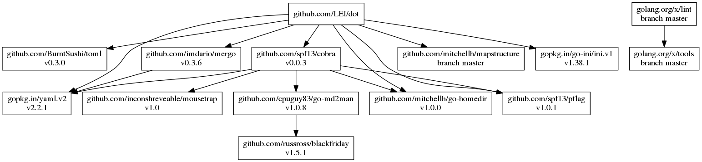

# dot

<!--
`dot` is a configuration based file manager. It requires Go 1.8 to compile.
-->

[Documentation](https://lei.github.io/dot/dot)

[](https://godoc.org/github.com/LEI/dot)
[](https://travis-ci.org/LEI/dot)
[](https://ci.appveyor.com/project/LEI/dot)
<!-- [](https://codecov.io/gh/LEI/dot) -->
[](https://goreportcard.com/report/github.com/LEI/dot)

<!--
## License
-->

## Installation

Release binaries are available on the
[releases](https://github.com/LEI/dot/releases) page.

### macOS

```sh
brew install lei/dot/dot
```

<!--
### Other platforms

```sh
curl https://raw.githubusercontent.com/golang/dep/master/install.sh | sh
```
-->

### From source

```sh
go get -u github.com/LEI/dot
cd $GOPATH/src/github.com/LEI/dot
go run build.go vendor check install # or `make`
```



<!--
## Feedback
-->

<!--
## Contributing

See [CONTRIBUTING.md](CONTRIBUTING.md) for more details.
-->
